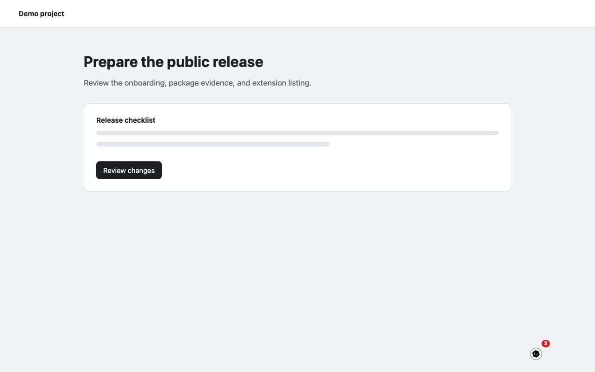

<p align="center"></p>

# Vibewaiting

[](LICENSE)
[](package.json)
[](ROADMAP.md)

**Your local Claude Code and Codex sessions, in a messenger on every browser tab—and
on your phone.** Follow what agents are doing, reply without changing windows, or
switch the same conversation into a familiar terminal.



> **Alpha.** The supported lane is macOS or Linux, Chrome/Chromium/Brave, and local
> Claude Code or Codex sessions. Installation uses a downloadable native companion;
> Chrome Web Store review of the signed extension is currently pending.

## Why Vibewaiting

- **Keep the browser in front.** A compact messenger follows you across ordinary tabs.
- **Use the sessions you already have.** Vibewaiting discovers local Claude Code and
  Codex conversations instead of creating another hosted agent account.
- **Chat or terminal, same conversation.** Continue headlessly or attach a tmux-backed
  terminal when you want the native CLI experience.
- **Take it to your phone.** One-scan, authenticated remote access works through a
  temporary tunnel or a stable relay you configure.
- **Attach the page in one action.** Send a selection, link, image, GitHub object,
  Hacker News item, or the visible page without copying it by hand.
- **Let Volter Harness agents use the tab you are already in.** Vibewaiting hosts
  Playwright itself, running inside the extension against the page—without a
  second automation browser. A page that forbids eval, such as GitHub, is driven
  through Chrome's debugger while the agent drives it, and Chrome shows its
  debugging bar on that tab. Before an agent types a password, submits, deletes or
  runs a script, the messenger asks you and names the exact action.

## Try the alpha

The release path is documented in [Install, update, and remove](docs/install.md). In
short: Chrome cannot directly read the transcripts, process state, or terminals owned
by local coding agents, so Vibewaiting uses a small on-device companion to bridge the
extension to them. Download that package from the latest GitHub Release, verify it
against `SHA256SUMS`, then run:

```sh
npm install --global ./vibewaiting-0.1.2.tgz
vibewaiting native install --browser chrome
```

The command prints the extension folder to load once from the browser's extensions
page. In Vibewaiting settings, review the website-access disclosure, choose **Allow
website access**, accept the browser prompt, and select a workspace; the launcher then appears
on ordinary HTTP and HTTPS pages. Brave and Chromium use `--browser brave` and
`--browser chromium`.

The signed `v0.1.2` artifacts, checksums, SBOM, and provenance are available from the
[latest GitHub Release](https://github.com/volter-ai/vibewaiting/releases/latest). The
same flow can also be exercised [from source](docs/install.md#install-from-source).

## What using it feels like

The conversation list behaves like a messenger: stable rows while agents are busy,
meaningful titles and latest-message previews, unread counts, timestamps, activity,
and nested subagents. Opening a conversation gives you two header-selected views:

- **Chat** renders normalized agent messages and compact, purpose-built tool activity.
- **Terminal** attaches the existing owned tmux session or resumes the same native
  session into one, then reshapes the overlay for terminal dimensions.

If an installed agent needs authentication, **Sign in** opens that agent's own CLI in
the terminal surface. A local extension click lets the native CLI open its browser;
a paired remote Codex click uses device code instead. Claude Code currently exposes no
verified browserless flag, so remote Claude sign-in fails clearly rather than pretending
the local browser flow is portable. Credentials remain owned by Claude Code or Codex and
never pass through Vibewaiting or Volter Harness.

Keyboard shortcuts open and focus the composer (`⌥⇧V` / `Alt+Shift+V`), attach the
current browser context (`⌥⇧A`), and move between conversations (`⌥⇧←` / `⌥⇧→`). All
four can be remapped from the browser's extension-shortcuts page.

## Privacy by construction

Vibewaiting has no account, analytics, ads, or hosted transcript service. The ordinary
page sees only the launcher; full session state renders in an extension-owned iframe.
Explicit attachment context crosses into the local companion only when you attach it;
browser tool results cross only when a local agent calls a tool. Native paths,
credentials, tmux handles, and execution policy never enter page content.
Remote access is off until you enable it.

An agent gets the tab you are looking at through a normal MCP server its harness
registers (`claude mcp add vibewaiting -- vibewaiting mcp`): Playwright's own browser
tools, answered inside the extension, without the tools that run code, touch files,
read the page's request headers and bodies, or reach other tabs. A tool's bounded result crosses the companion to that local agent.
Anything an agent does that can change a page or send it input (clicking, typing,
pressing keys, selecting, dragging, navigating, answering a dialog) asks you first in
the messenger, unless you allowed that site for the agent's task (until 15 minutes
pass unused, the tab closes, or the agent's MCP session ends); reading the page never
asks. Typing into password, one-time-code, card or file fields asks every time. See
[Browser tools](docs/browser-tools.md) for the exact tools and trust boundary.

What the cards protect against, plainly: an agent's mistakes, on pages that describe
themselves honestly. On most pages Vibewaiting drives the tab from inside the page, and
there a hostile page can mislabel its own elements (call a password box "Search", a Pay
button "Next"); cards there say "(as described by the page)". Nothing an agent types is
secret from the page it types into.

Read the plain-language [privacy policy](PRIVACY.md), [security model](SECURITY.md),
and [architecture](docs/architecture.md) before granting access.

Website access is optional. Vibewaiting onboarding explains what the page-facing script
does before the browser asks for HTTP/HTTPS access; disabling that access removes the
messenger and page-context listener from ordinary sites.

## Open-source boundary

Vibewaiting itself is MIT-licensed. Release archives include exact third-party notices,
a CycloneDX SBOM, checksums, and public provenance. Its shared agent semantics and
messenger components arrive as versioned, source-readable Volter Harness packages under MIT
or Apache-2.0; their upstream repository is not yet public. That means this checkout is
fully buildable and auditable as shipped, but changes inside those shared packages must
currently be coordinated upstream. See [Dependency transparency](docs/dependency-transparency.md)
for the exact boundary rather than assuming every dependency lives in this repository.

## Support matrix

| Surface | Current status |
| --- | --- |
| Claude Code | Supported alpha: discovery, read, continue, input, and terminal when capability evidence allows |
| Codex | Supported alpha: discovery, read, continue, input, and terminal when capability evidence allows |
| Chrome, Chromium, Brave | Supported through the unpacked extension |
| macOS, Linux | Supported native-companion platforms |
| Mobile browser | Supported through authenticated remote access; installable only on a configured stable origin |
| Gemini, Goose, OpenCode, Pi, Grok | Volter Harness can model them, but Vibewaiting does not yet claim a verified UI lane |
| Firefox, Windows | Not release-supported yet |

Unsupported capabilities stay hidden. A fallback harness identity or action is treated
as a bug, not a convenience.

## How it is built

Vibewaiting is a deliberately thin product composition:

- [Volter Harness packages](https://www.npmjs.com/package/@volter-ai-dev/supercode-client) own coding-agent session
  discovery, capabilities, continuation semantics, UI components, and terminal grants.
- [Widget Shell](https://github.com/volter-ai/widget-shell) owns the isolated overlay,
  responsive geometry, and visual lifecycle.
- [Volter Browsers](https://github.com/volter-ai/lucarne) is optional for managed or headless
  browser attachment; ordinary extension use does not require it.
- [Volter Tunnel](https://github.com/volter-ai/volter-tunnel) supplies stable and
  temporary remote transport.

The browser/native boundary and complete ownership map live in
[docs/architecture.md](docs/architecture.md).

## Contributing

Start with [CONTRIBUTING.md](CONTRIBUTING.md) and the [roadmap](ROADMAP.md). Bugs use
the issue form; setup and design questions belong in
[Discussions](https://github.com/volter-ai/vibewaiting/discussions); the complete routing
guide is in [SUPPORT.md](SUPPORT.md), and vulnerabilities follow [SECURITY.md](SECURITY.md).
The merge gate is intentionally under one minute;
Chromium runs only in the nightly workflow.

Vibewaiting is available under the [MIT License](LICENSE).
